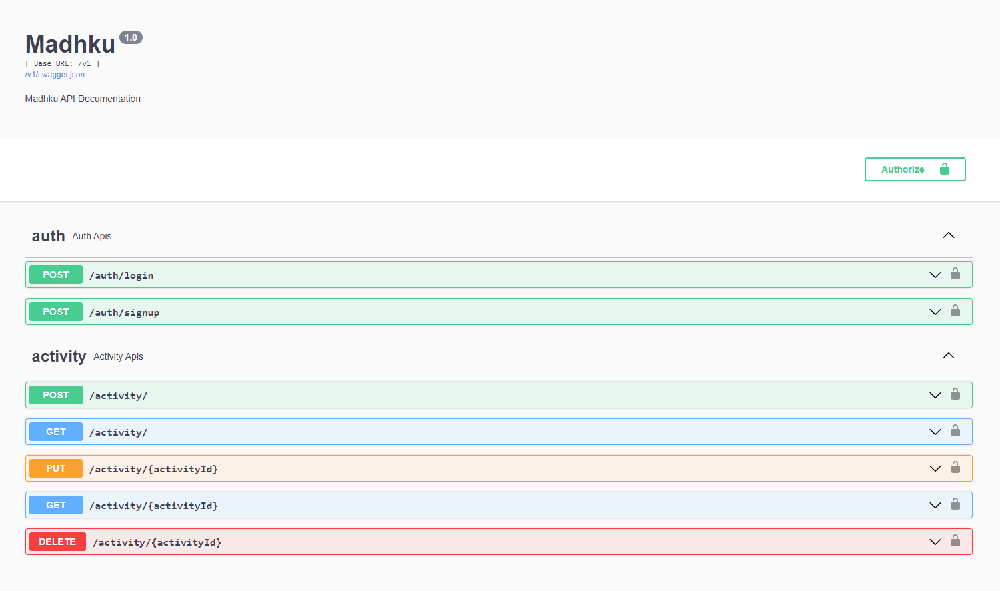

# Madhku API


API for tracking and managing activities of cycling.

## Tech Stack

-   **_Framework_**: Flask

-   **_Language_**: Python

-   **_Database_**: SQLite3

## Features

<details>
<summary>Click to see features</summary>

</br>

-   [x] Login/Signup
    -   [x] JWT token
    -   [x] Password hashing
-   [x] Activity
    -   [x] Create activity
    -   [x] Edit activity
    -   [x] Delete activity
    -   [x] Get all activities
    -   [x] Get weekly activities
    -   [x] Get stats of activities (total hour, total distance, total rides)

</details>

## Configuration

-   Create `.env` file

```env
DEBUG=True
PORT=5000
SECRET_KEY=Your_Secret_Key
```

-   Run API with below command

```bash
python app.py # Windows
python3 app.py # Linux
```

## Screenshot

<details>
<summary>Click to see screenshots</summary>

</br>



</details>

## Available on

[](https://github.com/rugvedkoshiya/Madhku-API/releases)

## License

Madhku API is distributed under the MIT Licence, See [Licence](LICENCE).
